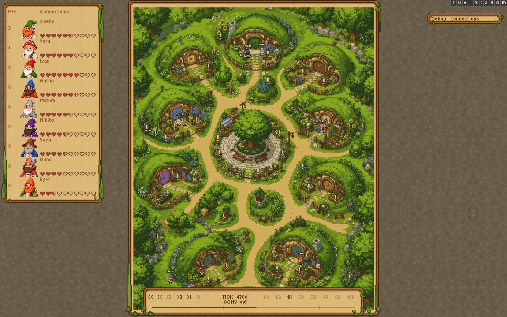
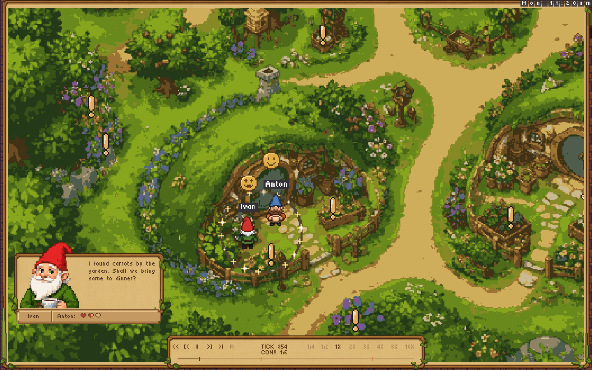
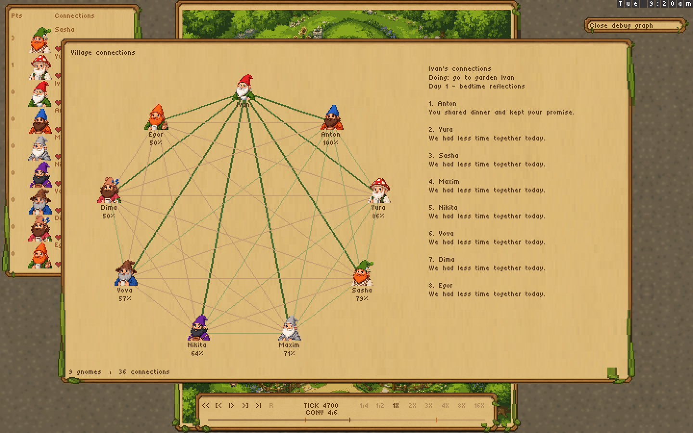

# Connections

This feature branch is rebased onto viewer stability PR #50 at `63146e5`.
Merge #50 first, then rebase onto master; the connections work stays in PR #51.

[Run a real local Claude-subscription playtest](claude-subscription-replays.md).

## What ships

- Each pair of seated gnomes has one shared connection in **[0, 1]**, initially **0.5**.
  Connections persist across days in an episode and reset for a new game.
- At **9pm**, after the day's dinner outcomes have entered each gnome's memory,
  the score screen waits for one bedtime interview per gnome. The model ranks
  every other seated gnome and gives short reasons grounded in that day's events.
- The compact left leaderboard shows **numeric game points** and **ten pixel
  connection hearts**. Heart fill is the average of that gnome's pair strengths
  multiplied by ten: five filled hearts initially, zero through ten overall.
  There are no bars. The existing game reward/winner rules are unchanged.
- Conversation cards keep the original font and 54px portraits. Their identity
  strip says **“Connection with Anton”** (the named listener) above three pixel
  hearts. A 0.5 pair is one full, one half-full and one empty heart.
- `send_emoji` is a deliberate model action targeting a nearby visible gnome:
  `happy`, `very_happy`, `sad`, or `very_sad`. Small pixel faces clear the gnome's
  portrait/body and disappear after their recorded animation. The recipient
  notices the reaction in its memory. Proximity and spoken-turn count no longer
  emit reactions or change the connection score.
- **Debug: connections** opens the full village graph; it is closed by default.
  All nine gnomes and all 36 pairs remain visible. Select a graph portrait to
  highlight its edges, inspect the percentages, last recorded action and bedtime
  ranking/reasons. Long reflections have pages. Close the graph with the same
  debug button. Leaderboard rows have no inspector click action.
- Pair snapshots, interviews, actions and reactions travel inside the replay.
  Both native and static viewers derive them from the playhead, including backward
  seeks and concurrent-conversation rewinds. Old replays remain playable and show
  unavailable relationship data, rather than fabricated interviews.

## Daily arithmetic and edge cases

For a gnome ranking `m` other gnomes, rank 1 is most connected:

```text
contribution(rank, m) = 0.5 - (rank - 1) / (m - 1)
delta(A,B) = (A's contribution to B + B's contribution to A) / 2
new_connection(A,B) = clamp(old_connection(A,B) + delta(A,B), 0, 1)
```

Both first: +0.5. Both last: -0.5. First versus last: zero. Intermediate ranks
are evenly spaced. This is a relative ranking system: a low rank can decrease a
connection even without a deliberately harmful action. Clamping can change the village's
total connection score. There is no separate bonus for promises, dinners, or emoji;
models use those experiences as evidence in their rankings.

Rankings must contain every other seated gnome exactly once, with a nonempty reason
of at most 240 characters each. Ties are not part of this version. Unknown partners
must be ranked honestly as little/no interaction. With zero or one possible partner,
ordinal position provides no contrast, so the contribution is zero.

All changes commit together once per day. Missing, invalid, failed or timed-out
interviews contribute zero, without inventing a ranking. The other gnome's valid
contribution still supplies its half of the update. There is a **45-second overall
deadline** by default. Slow local transports can set
`HEARTLEAF_INTERVIEW_TIMEOUT_SECONDS=300` (bounded to 5–300 seconds); this does not
change the neutral fallback or nightly arithmetic. Requests receive a 1,200-token
output budget through the Bedrock API. Stale responses, including
responses from a prior game, cannot be applied to a new request. Gnomes receive their
old/new pair strengths and the partner's recorded reason for discussion tomorrow.

## Review and validation

The committed fixture is an **authored two-day scenario with scripted model replies**,
not a paid/autonomous model run. It uses normal movement and the actual brain
interview/action handlers. It has nine gnomes, six conversations, eighteen valid
bedtime interviews, two daily commits and twelve deliberate reactions. All 9,120
simulation ticks replay with matching hashes; the full director playback is checked
for stalls. These hashes cover the simulation; recorded connection metadata is
validated and separately tested for correct playhead folding.

```sh
nim r tests/connections.nim
nim r tools/record_connection_scenario.nim out/connections-scenario.replay
nim r tests/connections_viewer.nim out/connections-scenario.replay out/connections-review
nim c -d:release src/heartleaf.nim
out/heartleaf --load-replay:docs/connections/two-day.replay --port:8084
# Open http://localhost:8084/
```

Also checked: core tests, native integration, viewer stability, navigation, ordered
control clicks, eight playback speeds and 64 pause/speed combinations, routes, and
the static WASM build. New viewer checks exercise selection, reflection pages,
pause, next/previous, speeds, end/restart, and forward/backward seeks across days.

The images below are **offline renders of actual replay sprite-protocol frames**.
The Mac was locked, so OS/browser click-through was unavailable. The authored
fixture does not validate model ranking quality or request latency. Claude
subscription playtest observations are documented separately when complete.





## Out of scope

Production deployment or merge; tournament reward changes; automatic promise
tracking or event-based point bonuses; ties/absolute ratings; relationship decay;
persistence across separate episodes; the removed right-side conversation list;
and automatic live-model quality evaluation. PR #50's replay controls, camera
timing, map geometry, font sizes, muted ground texture and original portrait pixels
are preserved. Its removed logo and bricks are not restored.
