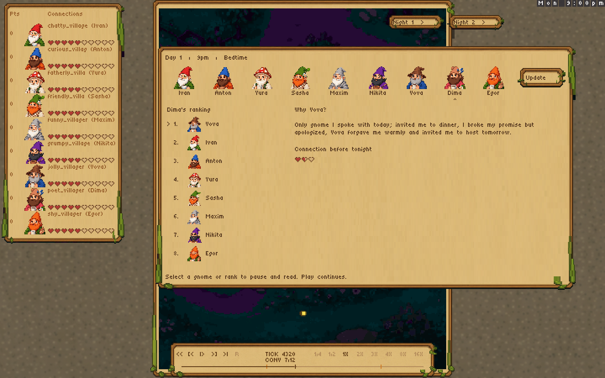
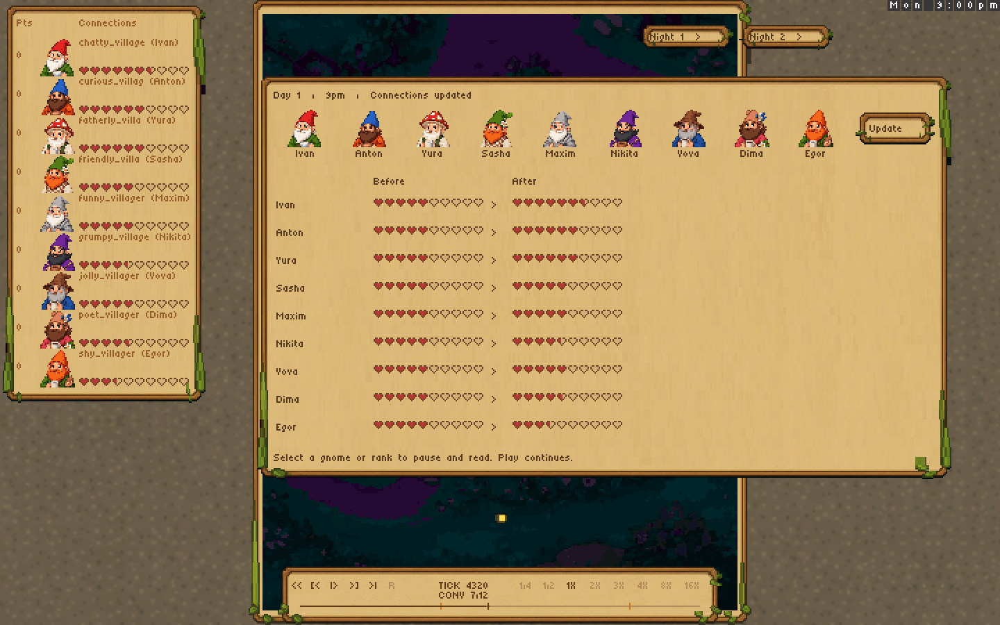
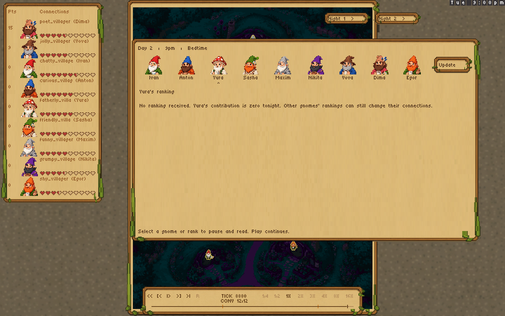
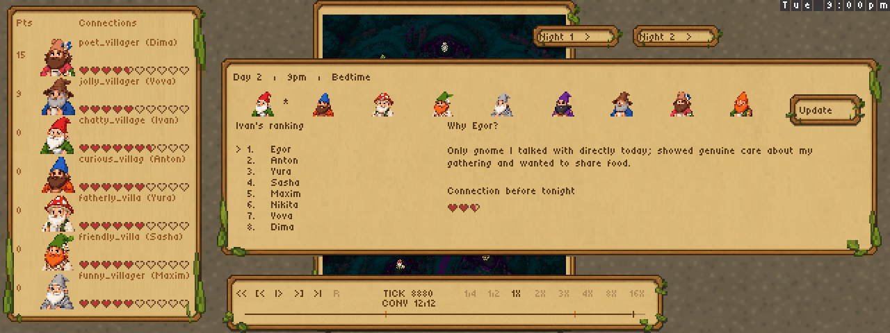
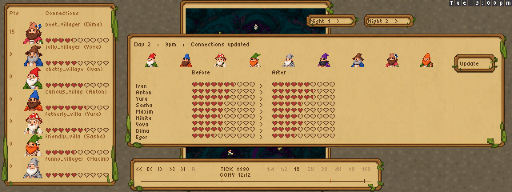

# Bedtime rankings and connection updates

At 9pm the replay presents each gnome's recorded ranking, then shows the before/after
connection hearts. Use **Night 1** or **Night 2** to jump there. Select a portrait
or ranked gnome to pause and read; Play resumes. **Update** opens the final summary.
The left leaderboard changes when the summary appears.

## Dima's first-night ranking and reason

## Connections update after the rankings

## A missing second-night interview

## Compact window checks

These are inspected native sprite-protocol renders from the unchanged real Claude
recording, not browser screenshots. Continuous playback reaches all 12 conversations,
all 18 gnome pages and both nightly updates, with 49 distinct aired dialogue lines.
All eight speeds complete with matching simulation hashes. The complete 1X show
is 12,993 frames (~9 minutes), including bedtime reading time. The new scene does
not repair sparse movement decisions already stored in the old recording.
