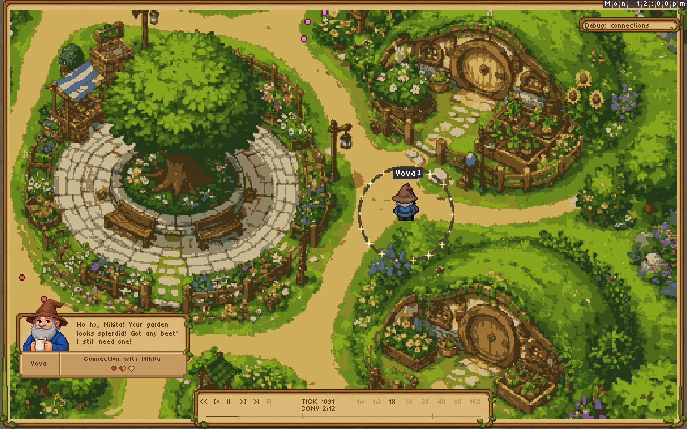
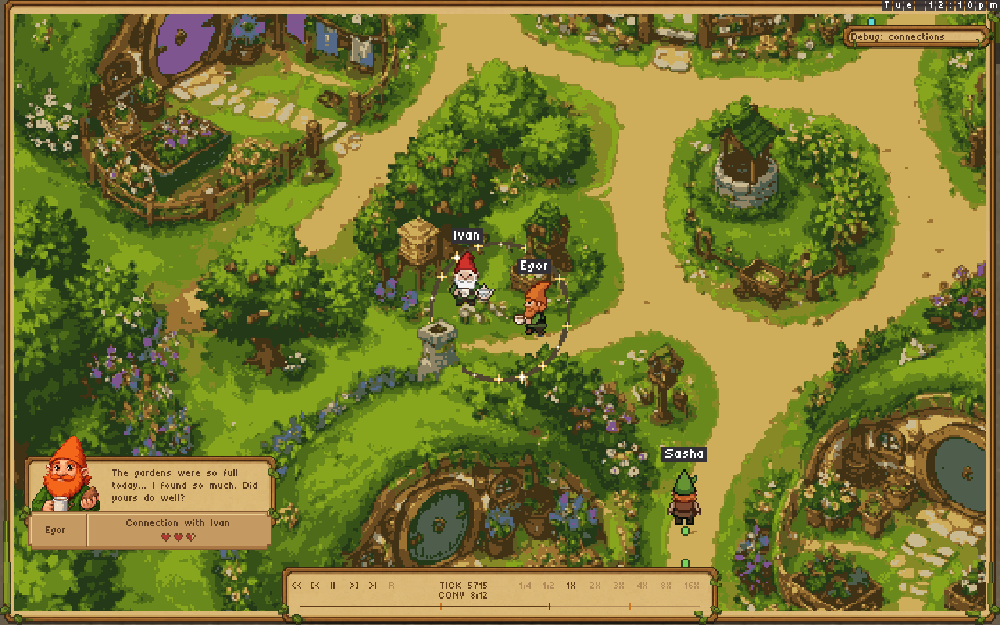
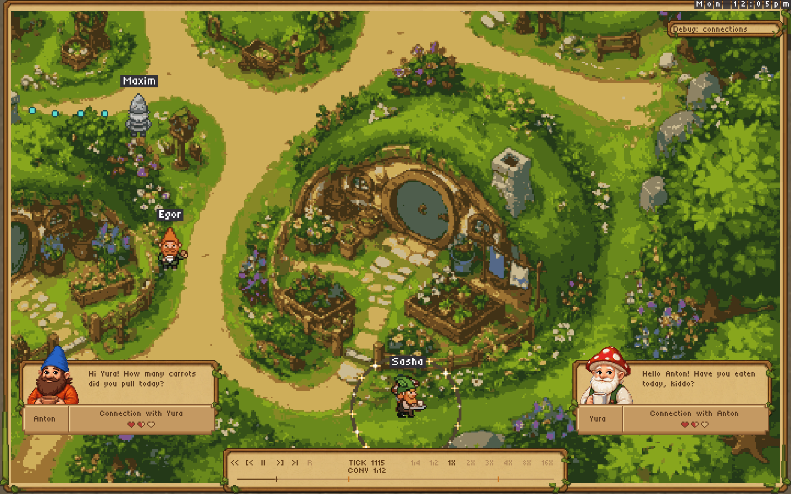
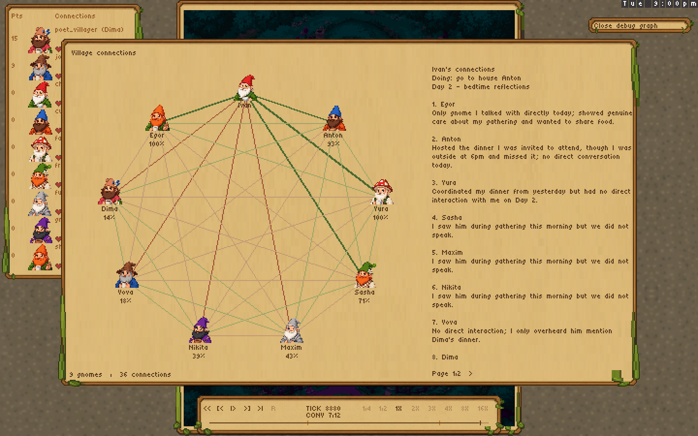

# Director repair — real replay review

The real recording is unchanged. The viewer now advances quickly through silence,
keeps readable dialogue, and closes leftover groups at the new recorded day.
The live runtime also clears yesterday's encounter membership.

Full autoplay at 1X reaches all 12 conversations in 8,821 frames (about 6 minutes),
compared with 93,549 frames (about 65 minutes) before the repair. The first shot
now takes 36.7 seconds, compared with 451.8 seconds. All eight speeds finish,
all simulation hashes match, and 49 distinct lines air in the 1X run.

These are actual sprite-protocol renders, not browser captures. The two autoplay
images below were captured during continuous playback, 100 frames after those
conversations became the director's focus. The Mac remains locked, so GPU/browser
click-through is still not independently verified.

## The second conversation is reached automatically

## The director reaches day two and another pair

## Current UI

Run `nim r tests/real_replay_director.nim out/real-director-review` for full
continuous playback, pause, every conversation and every speed. The separate
`render_connection_replay.nim` command supplies the current UI seek renders.
