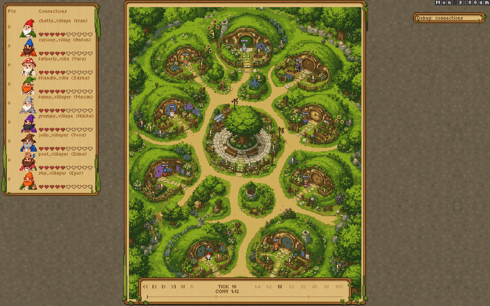
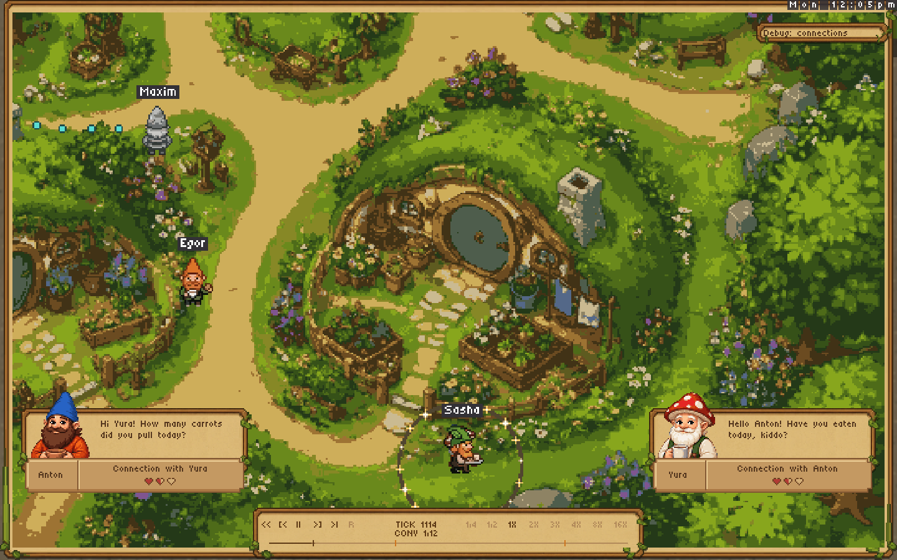
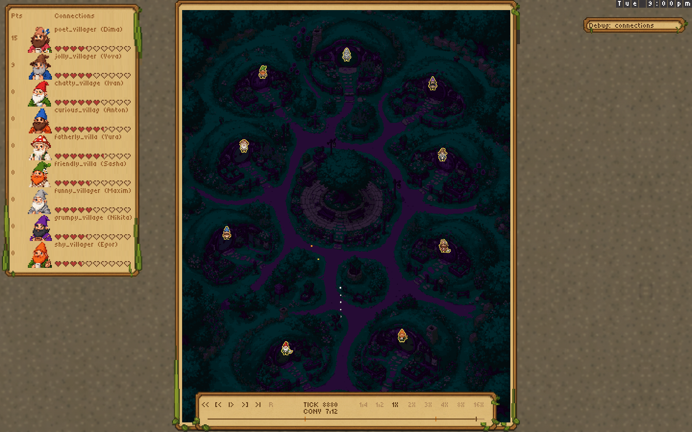

# Connections review — September 11, 2026

Fresh renders from the current PR #51 viewer code (`d126ca2f1fc1c078afc84830cb1123bef7913dc8`), rebased on PR #50 (`e164a7e`). These show the requested UI revisions. This gallery is the current review set; earlier image paths now point to copies of these frames.

Source: the [real nine-gnome, two-day Claude replay](../claude/two-day.bitreplay), SHA-256 `6428c9ef463dacc00d31bd5e718f336af05098bb19a4a7dd90f2f071810d8804`. These are **offline renders of the game's actual drawing packets**, not browser screenshots or design mockups. Browser click-through remains a separate check. [Run provenance and observations](../claude-observations.md).

## Numeric points and ten Connections hearts

Points are a number at the left. Connections use ten pixel hearts, initially five filled. There are no points bars or “bonds” labels. The graph is closed in ordinary play; only its debug button is visible.



## Updated conversation cards

One card per speaker, with the original portrait and font. Yura's strip says **Connection with Anton**; Anton's says **Connection with Yura**. Three hearts show that pair's strength. The camera uses the full viewport for the conversation.



## Scores and connections after two days

Dima has 15 points and Vova has 9; points remain numeric. Heart fills reflect the two recorded bedtime updates. The graph is still closed.



## Full graph, opened explicitly for debugging

This image deliberately opens **Debug: connections**. All nine gnomes and all 36 pairs appear, with Ivan selected to inspect his pair strengths and recorded bedtime reasons. This is not the default game view.


## Reproduce these images

```sh
nim r tools/render_connection_replay.nim docs/connections/claude/two-day.bitreplay docs/connections/review-2026-09-11
```

The render pass checks replay hashes at its seeks. The complete recording separately passes all 9,120 simulation hashes; see the [validation record](../claude/validation.txt).
