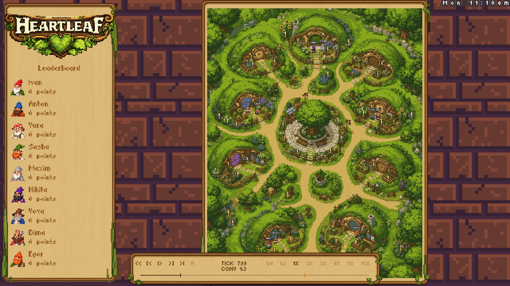
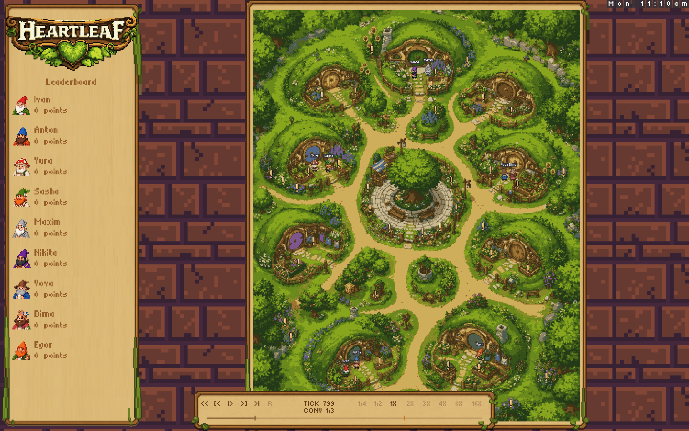
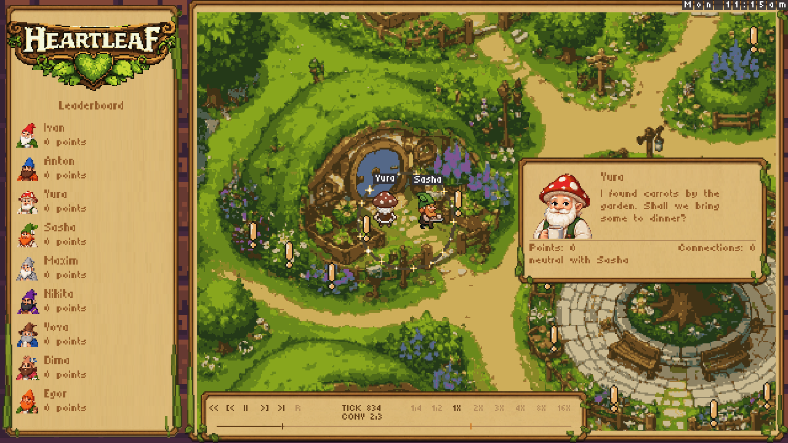
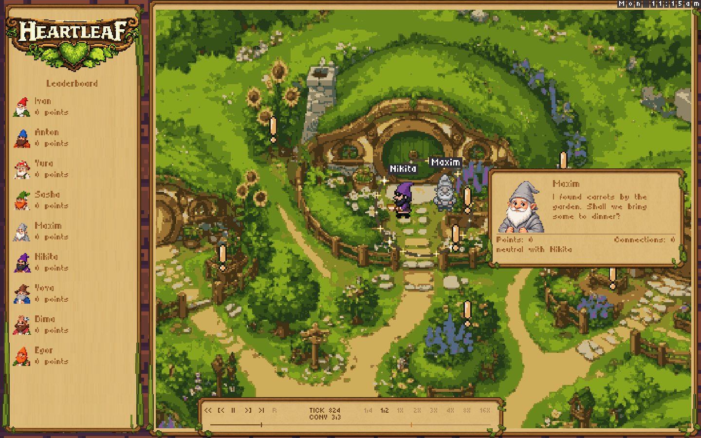
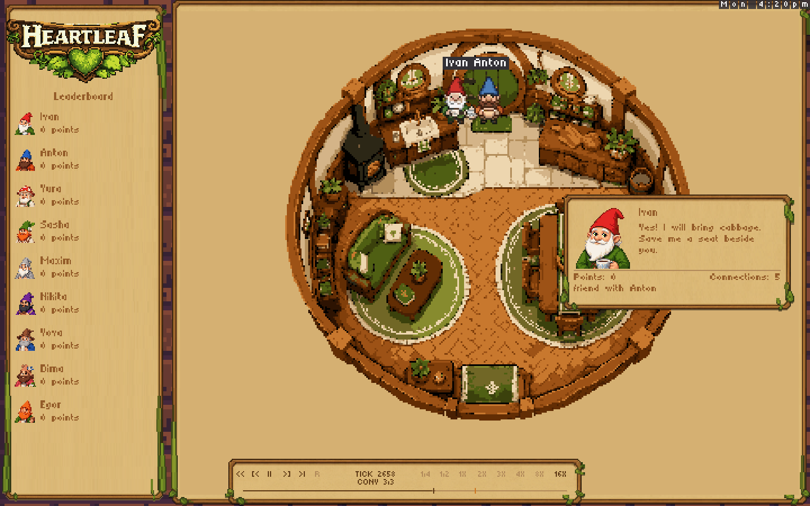

# Viewer stability candidate

This change preserves the hand-drawn village, walk masks, house locations,
resources, replay format, and game rules.

- The supplied pixel-brick tile fills the surround. Circular room interiors retain
  light parchment (`#d5b072`). The map uses the existing
  pixel-art wooden and leafy border. The frame masks overflow and expands with the camera during zoom.
- The full-village overview fills the window height, beside the left leaderboard. Conversation shots
  fill that central stage with a wider camera crop, without stretching the map.
  Crops stay inside the village art at map edges and in ultrawide windows.
  In narrow portrait windows, the overview fits the width to keep the whole
  village visible. Playback controls never reduce its size.
- The settled director shot shows the current speaker's card: one portrait,
  name, full recorded line, points, connection points, and relation to the listener.
  The card overlays a clear edge of the full-screen scene and moves aside if
  gnomes occupy that space. Wide shots and outdoor camera transitions have no card.
- This restores the card contents from [director PR #35](https://github.com/Metta-AI/coworld-heartleaf/pull/35).
  The old two-portrait bottom banner is absent in director mode. Empty card
  frame, portrait, rule and letter sprites are reused; changing a line does not
  resend the whole card.
- A host plus one guest qualifies for a room shot. Eligible rooms rotate, with
  their own camera coordinates and a transparent circular exterior.
- The three emotion tiers use 16×16 pixel faces, half the previous width and
  height, anchored above names. Their placement
  clears nearby gnomes too. Whole pixel blocks dissolve during the fade:
  partial alpha in the pinned client's map layer could erase the map underneath.
- Live viewers report their actual size, including after reconnect. Saved
  replays retain pause, seek and speed controls; live had no pause/rewind before
  the earlier PRs.
- Native and static replays share queue, camera and dialogue stepping at 24 Hz.
  The static build uses the director and unsigned 32-bit visual noise arithmetic.

## Leafy Heartleaf title

The left panel now carries a large Heartleaf wooden sign with cream lettering,
curling vines and a green heart-leaf ornament. This reuses `data/logo.aseprite`;
the original asset is unchanged. The wordmark is cropped away from the upper
cottage illustration, follows the sign's bowed edge, and uses nearest-pixel
sampling. It is loaded once and sent as a cached sprite.

The second art iteration removes the strip of scenery above the lettering and
adds space around the sign. Header and row spacing keep all nine gnomes visible
in the checked desktop, laptop, narrow portrait and 1280×600 layouts.

Regenerate these protocol renders with:
`nim r tools/render_viewer_brand.nim out/title-review`.



[Conversation view](viewer-stability/simple-04-conversation.png) ·
[Laptop](viewer-stability/simple-02-laptop.png) ·
[Narrow panel](viewer-stability/simple-03-narrow.png) ·
[Short window](viewer-stability/simple-05-short-window.png)

## Current layout, text and controls

The viewer has a left Heartleaf leaderboard and the game beside it. The right
conversation list, card X and browser press/pop animation were removed after
review. The ordinary transport remains. Narrow windows can toggle the leaderboard.

Tiny5's source character grid is 6 pixels high. Dialogue, scores and relation
text now use 7 logical pixels; gnome names use 8, rather than the previous 12.
Glyphs use nearest-pixel sampling and width-aware wrapping. At the common 2×
window scale, these grids occupy 14 and 16 display pixels. The native 54×54
portrait, individual glyph cache and shared frame sprites remain.

`data/viewer-bricks.png` is the tile supplied by Alessandro on September 9.
It is reused unchanged, sampled at half size and tiled behind the framed game
and parchment leaderboard. The title still uses the existing Heartleaf logo.

### Button diagnosis and repairs

- The old state stored one pending click. Two next-conversation clicks before
  a frame advanced only once. Input now preserves every click and its order.
- Seeks and commands previously drained into separate lists, which could
  reorder play/seek combinations. One input queue preserves arrival order.
- The director slowed only 1× playback. In a settled conversation, 100 frames
  advanced 20 ticks at 1×, 50 at ½×, and 25 at ¼×. All speeds now multiply the
  same director pace: the corresponding results are 20, 10, and 5 ticks.
- Previous selected the same committed conversation repeatedly. It now selects
  the preceding conversation. Play at the recording end restarts playback.
- Camera cuts hold the first conversation tick at every speed, including the
  first frame of a cut. Pause still freezes the whole presentation.

The speed buttons `1/4` and `1/2` mean quarter and half speed, not 1.4× or 1.2×.
The director still uses slower conversation pacing and faster travel between
conversations. The selected speed multiplies those respective base rates.

`tests/viewer_controls.nim` sends actual sprite-client packets through the shared
native/static entrypoint. It checks rapid next clicks, previous, double toggles,
play/seek ordering, all eight speeds, 64 pause/speed combinations, end/restart,
cut boundaries and a complete 4,500-tick replay with matching hashes.
The full local unit, viewer, route and integration suites pass, as do native
and pinned WASM builds. A real native WebSocket run acknowledged all 12
play/pause trials in 21–53 ms (median 30 ms), and reached tick 4,500 in 65.6
seconds at 16×. These measure server response, not browser display latency.

Current images below are offline renders of actual replay packets, not browser
screenshots. Browser input-to-paint timing remains unverified while the Mac is locked.









[Short window](viewer-stability/simple-05-short-window.png) ·
[Narrow leaderboard](viewer-stability/simple-03-narrow.png)

## Playback and portrait repairs

- Pause now freezes the camera, room rotation, speaker hops and dialogue read
  time as well as the simulation. Resume advances the camera on its first frame.
  A paused seek or next-conversation command refreshes its destination once.
- The visible map frame and camera now share the two-second eased transition.
  Entering a conversation no longer forces an immediate 1.67–2.29× zoom to fill
  a wider rectangle. World-edge bounds include integer viewport rounding.
- Transport targets grow from 12×7 to 14×20 logical pixels, including the gaps
  between glyphs. Speed targets also grow; neither overlaps the scrubber.
- Portraits use the original 54×54 pixel art instead of reducing it to 36×36:
  50% larger in each dimension. Text reflows beside it; the score and connection
  footer stays below both.

At every speed the director holds simulation ticks during a camera glide so
recorded dialogue begins after settling. Play resumes that glide immediately.

## Reproduce the local test game

The included [test replay](viewer-stability/local-viewer-scenario.replay) was
recorded from a new nine-gnome simulation with seed 7301: three concurrent
outdoor conversations, two host-plus-guest dinner rooms, and 4,500 ticks.
Decisions and dialogue are authored for this test; this is not a model-generated
playthrough. Gnomes use the ordinary navigation executor and doors. Every tick
hash is recorded and checked. No archived inputs or edited game states are used.

```sh
nim r tools/record_viewer_scenario.nim out/viewer-scenario.replay
out/heartleaf --port:8082 --load-replay:out/viewer-scenario.replay
# Open http://localhost:8082/client/global
```

The generator also checks the full shared director playback: 18,161 frames,
all three concurrent conversations, no stall, and matching hashes at completion.
CI regenerates this scenario. Offline captures can be reproduced with:

```sh
nim r tools/render_replay_review.nim out/viewer-scenario.replay out/replay-review
```

Native WebSocket trials acknowledged 36/36 play/pause clicks after loading:
9–71 ms in the overview and 7–49 ms in a conversation. These measure server
response, not browser input-to-paint latency. Initial asset/control loading took
about 1.8 seconds. The final native server streamed the whole recording to tick
4,500 at 16X in 16.4 seconds, with no hash mismatch. Sixty paused presentation frames produced pixel-identical
images. Native, unit, viewer, route, integration and static build checks pass.

Earlier stability iteration (before the side panels):


[Animated offline zoom sequence](viewer-stability/zoom-playback.webp) ·
[Portrait-window conversation](viewer-stability/playback-narrow.png)

## Two surrounds

Open `/client/global` for parchment, or append `?background=forest` for the forest
comparison. Static URLs accept the same parameter alongside `replay`.

The optional forest has no extra houses and uses the map's day/night tint.
Its generated joins still need art review. The brick surround is the current default.

`data/forest.png` and `data/forest-frame.png` were generated on September 8 using
OpenAI ImageGen with the existing `data/backdrop.png` and `docs/heartleafMap.png`
as references. Original village and home source art is unchanged. Forest
textures load only when selected.

## Validation

Baseline: master `ad3c138`, dependencies from `nimby.lock`.
Native Nim 2.2.10; static Nim 2.2.4 and Emscripten 4.0.15.

```sh
nim c src/heartleaf.nim
nim r tests/tests.nim
nim r tests/viewer_stability.nim
nim r tests/viewer_navigation.nim
nim r tests/viewer_controls.nim
nim r tests/routes.nim
HEARTLEAF_SERVER=out/heartleaf nim r tests/integration.nim
nim c -d:emscripten wasm/replay_viewer.nim
nim r tools/render_viewer_review.nim out/viewer-review
```

Regressions cover party eligibility, room transparency through night tints,
unchanged gameplay hashes, portrait/landscape layout, one portrait with score
and connections, card-component reuse across changed text, absence of the old
banner, no card in wide shots or camera travel, every emoji animation phase
clearing both gnome bodies, opaque/dissolved icon pixels, and conversation
playback with pause/seek.

The archived two-day recording
[116ed90d-3374-4bc7-8152-0e79dfe8eee0](https://softmax-public.s3.amazonaws.com/replays/116ed90d-3374-4bc7-8152-0e79dfe8eee0.replay)
and a synthetic conversation fixture reached tick 9120 with matching hashes.
Before this visual refinement, the static fixture also completed in Chrome
without captured browser errors. CI includes the native tests and static bundle.

## Earlier controlled visual evidence (before the current layout)

All images above and below are **offline renders of actual sprite-protocol packets**, using a small
review tool that mirrors the pinned client's layer composition. The additional images below use a
controlled two-gnome scene. They are not browser screenshots. The Mac was locked
during this refinement, so a fresh browser/GPU check remains pending.

The reviewed frames cover wide view, full-screen outdoor zoom in progress and settled,
map-edge card placement, portrait view, and circular rooms at zoom start,
settled, and night. The complete circular room clears the transport. No black
bars or opaque exterior room rectangle appeared in those renders. Intended
night shading inside the room is preserved.


[Portrait conversation and closer emoji view](viewer-stability/rendered-director-portrait.png)

## Review limits

Andre's original freeze recording is unavailable; completing other fixtures
does not diagnose or close that failure. Forest joins require art review.
Fresh browser/GPU validation and hosted testing remain pending. No PR merge or production game deployment has been performed.
