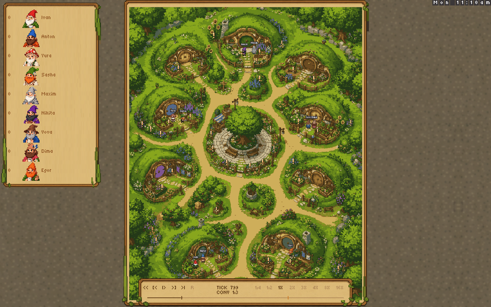
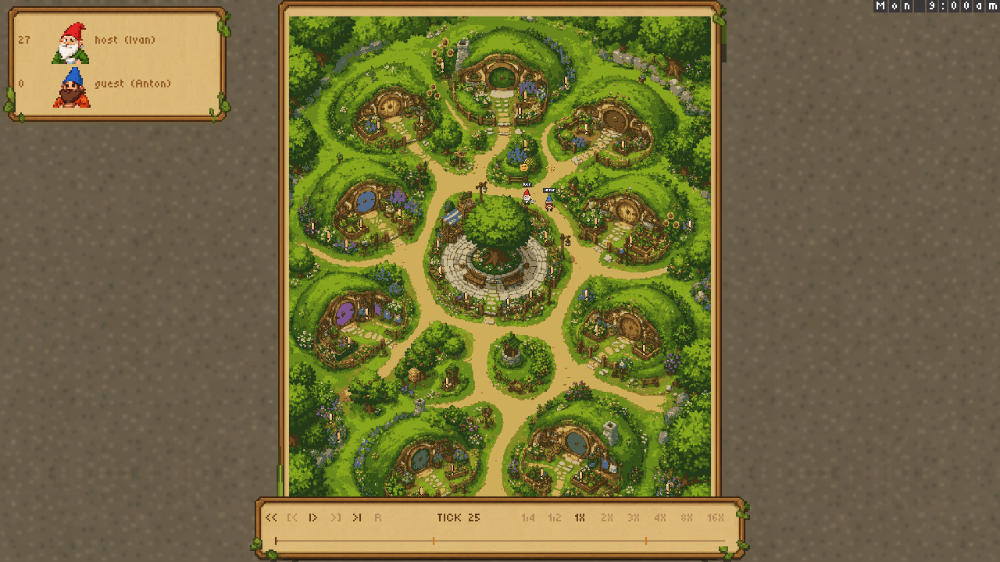
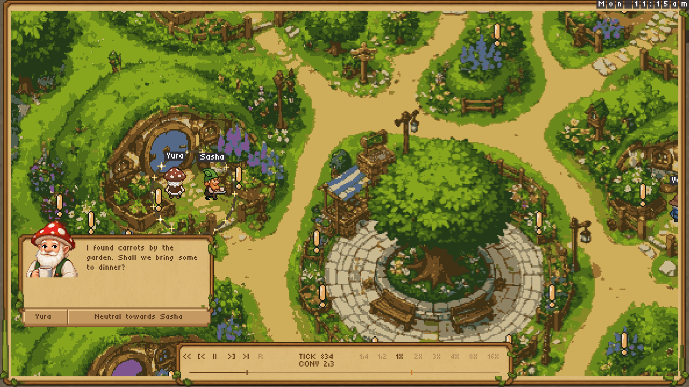
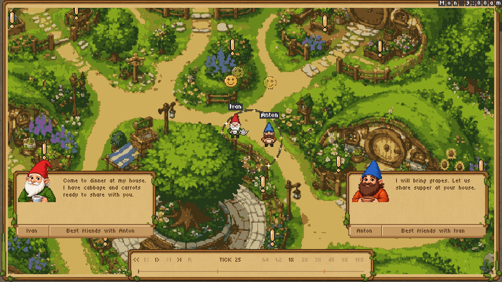
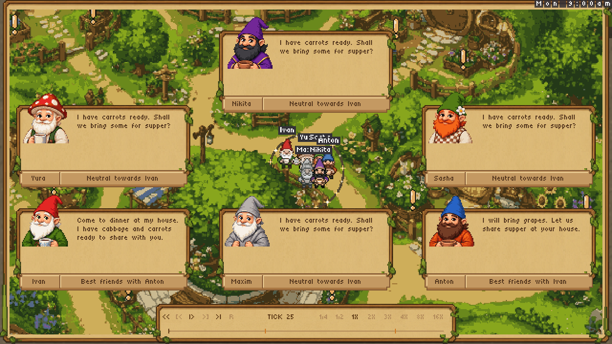
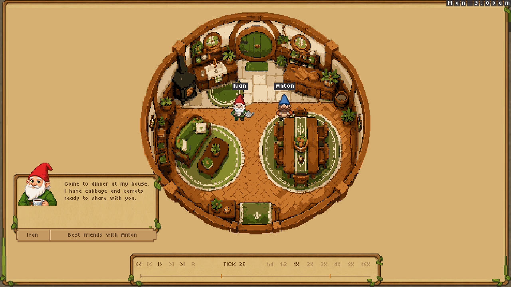
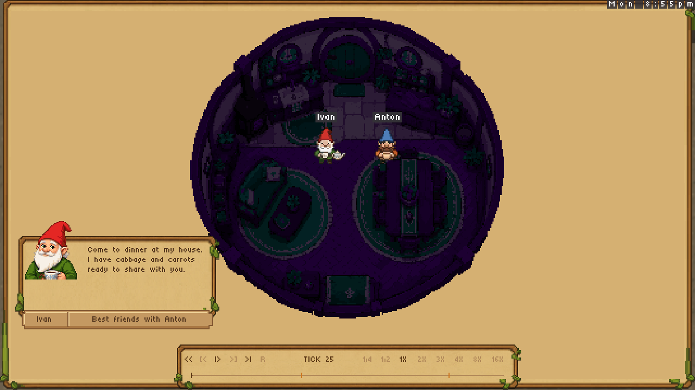
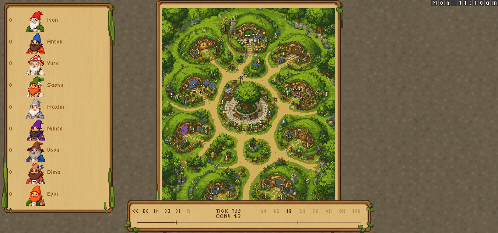
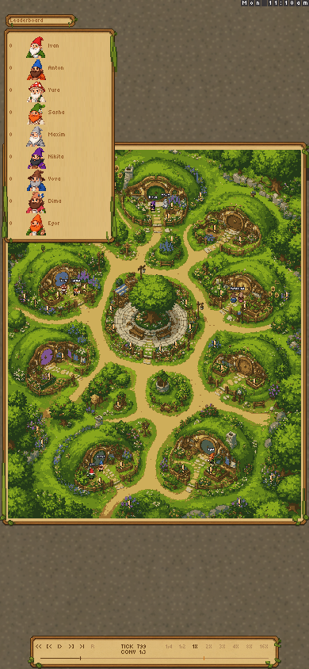

# Viewer stability and current review gallery

PR #50 repairs replay controls and director presentation while preserving the
hand-drawn village, walk masks, house locations, replay format, and game rules.

## Shipping behavior

- The village overview fills the window height and is centered, with a compact
  leaderboard on the left. Narrow windows fit the entire village width and
  offer a leaderboard toggle. Conversation shots hide the leaderboard and fill
  the window with the world. The wooden, leafy map frame follows the camera.
- The leaderboard has score, portrait, and player/gnome name on each row. Its
  parchment ends after the final entry; it has no Heartleaf logo or heading.
  Nine gnomes fit the checked 1280×600 desktop window.
- The default surround uses Alessandro's September 10 texture, stored unchanged
  in `data/viewer-ground.png`. Adjacent tiles mirror at their shared edge, so
  the source pixels meet without an abrupt repeat boundary. The brick asset
  and the viewer's logo crop/resizing code have been removed.
- Settled conversation shots show one compact card per gnome who has spoken,
  updated with their latest aired line. Portraits protrude above the parchment;
  the bottom strip holds only name and relationship. Cards avoid each other
  and the transport. Small windows show the most recent speakers that fit.
- Dialogue portraits retain all 54×54 source pixels. Leaderboard icons use a
  uniform 2:1 reduction to 27×27 instead of the previous irregular 54→20
  sampling. The former 54→81 dialogue enlargement also alternated pixel widths.
  Original Tiny5 glyphs and spacing remain unchanged. Frames, portraits, and
  letters are cached separately; changing dialogue does not resend a whole card.
- The director visits host-plus-guest rooms and rotates eligible parties. Room
  corners remain transparent through night shading. Small 16×16 pixel emotes
  clear the gnomes and their names.

## Playback repairs

Pause freezes simulation, camera, dialogue timing, and room rotation. Resume
advances the presentation immediately. Camera travel and its frame share a
two-second eased transition, with dialogue held until the shot settles.

One ordered input queue retains rapid clicks and play/seek ordering. Previous
conversation selects the preceding conversation; play at the end restarts.
Every playback speed multiplies the same director pace. The `1/4` and `1/2`
buttons mean quarter and half speed. Button art is unchanged, with no added
press animation. Native and static viewers share the same presentation logic.
Live viewers report their real viewport dimensions; replay transport remains
for saved games, as before the earlier PRs.

## Current images — September 10

These are **offline renders of actual game drawing packets**, using the pinned
Bitworld client's composition rules. They are not browser screenshots. The Mac
was locked during this review, so fresh browser/GPU and click-to-paint checks
remain pending. All older screenshot iterations were removed from this gallery.

### Overview: new texture, no logo, compact nine-player leaderboard



### Two-player leaderboard: frame ends after its rows



### Conversation: unresampled portrait and original lettering



### Multiple speakers: one card per gnome





### Circular rooms, including night





### Smaller windows





The overview, single-card, and window-size captures use the included replay.
The two-player, multiple-card, and room captures use controlled review scenes.
Regenerate both sets from the repo root:

```sh
nim r tools/render_viewer_overview.nim out/review-overview
nim r tools/render_viewer_review.nim out/review-controlled
```

## Test replay and validation

The included [test replay](viewer-stability/local-viewer-scenario.replay) has
nine gnomes, seed 7301, three concurrent outdoor conversations, two dinner
rooms, and 4,500 ticks. Decisions and dialogue are authored for this test; this
is not a model-generated playthrough. Gnomes use normal navigation and doors,
and replay hashes are checked.

```sh
nim c -d:release src/heartleaf.nim
nim r tools/record_viewer_scenario.nim out/viewer-scenario.replay
out/heartleaf --port:8082 --load-replay:out/viewer-scenario.replay
# Open http://localhost:8082/client/global
```

Install dependencies from `nimby.lock` in the parent workspace first. Native
validation covers the game and soul-player builds, unit tests, viewer stability,
leaderboard layout, controls, routes, integration, and regeneration/playback of
the complete scenario. New assertions check content-fit panel height, all nine
short-window rows, exact dialogue portrait pixels, uniform thumbnail sampling,
and absent logo sprites. Existing controls coverage includes 64 pause/speed
combinations, rapid next clicks, seek ordering, and end/restart behavior.

```sh
nim check src/heartleaf.nim
nim c -d:release players/soul_player/soul_player.nim
nim r tests/tests.nim
nim r tests/viewer_stability.nim
nim r tests/viewer_navigation.nim
nim r tests/viewer_controls.nim
nim r tests/routes.nim
HEARTLEAF_SERVER=out/heartleaf nim r tests/integration.nim
tools/build_replay_viewer.sh "$PWD/out/static-replay-viewer"
```

The September 10 local run used native Nim 2.2.12 and the pinned static Nim
2.2.4/Emscripten toolchain; GitHub CI uses native Nim 2.2.10. See the PR checks
for CI results on its current head. All local suites and both builds passed.
A fresh native WebSocket run acknowledged all 12 play/pause trials in 24–51 ms
(median 28 ms) and streamed the complete 4,500-tick recording. These are server
response timings, not browser display latency.

## Out of scope and remaining limits

No new connection mechanics, gnome dialogue generation, horizontal village
redraw, right-hand conversation list, card close button, text enlargement,
production deployment, or PR merge is included.

Andre's original replay-freeze recording is unavailable. Other complete replay
runs do not diagnose that specific failure. The optional `?background=forest`
comparison remains available, but its generated joins still need art review.
The forest assets were generated on September 8 using OpenAI ImageGen with the
existing village art as reference; the original village and home art is unchanged.
Fresh browser/GPU validation and hosted testing remain pending.
