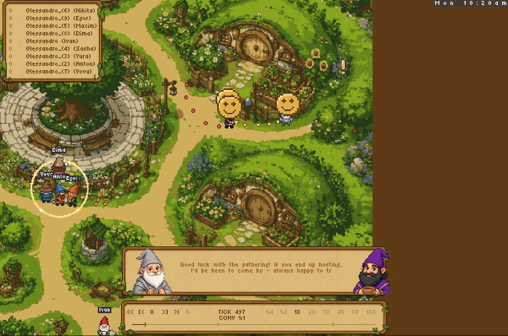
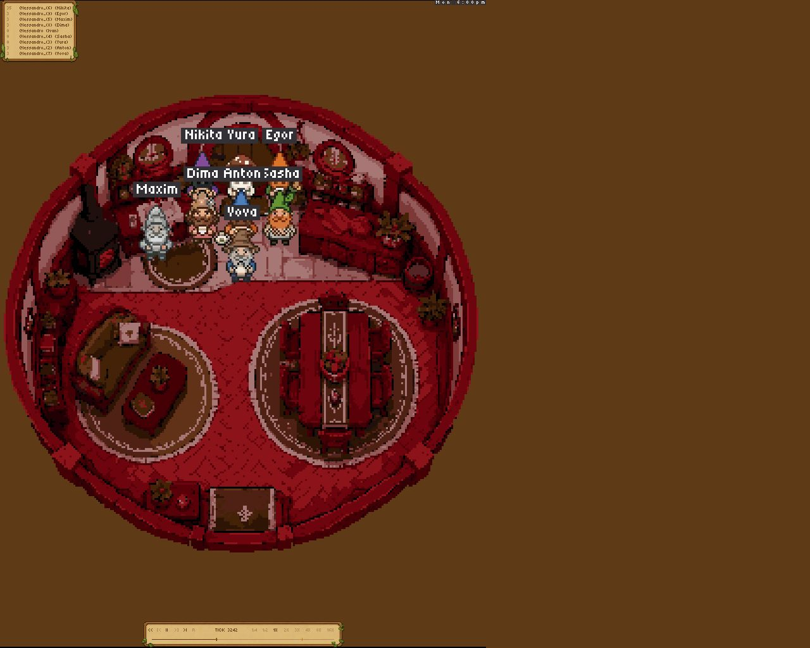
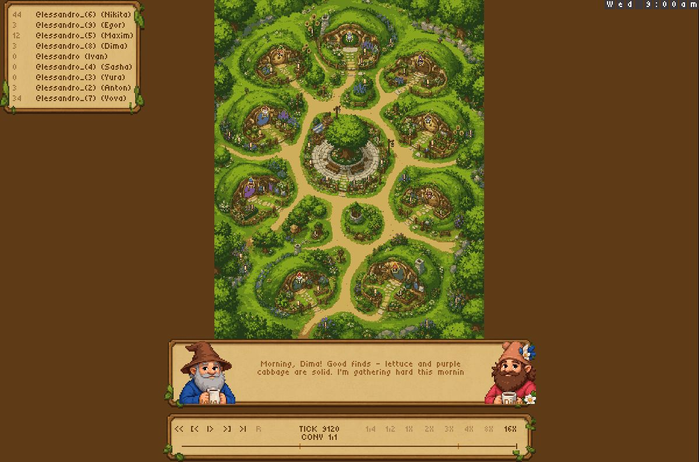

# Viewer stability candidate

This change preserves the hand-drawn village, walk masks, house locations,
resources, replay format, and game rules. It repairs the presentation shared by
live spectators, server-served replays, and the static replay bundle.

- Brown framing is the default. The world viewport fills the window, with space
  for bottom dialogue/transport and the scoreboard in portrait windows.
- Director dialogue uses the existing parchment, portrait and glyph sprites.
  It stays below the leaderboard and does not resend a rasterized card per line.
- A host plus one guest qualifies for a room shot. Eligible rooms rotate, and
  each room uses its own camera coordinates with a transparent circular exterior.
- The three existing emotion tiers use hand-authored pixel faces.
- Live viewers report their actual size, including after reconnect. Live retains
  its historical lack of pause/rewind; saved replays retain their transport.
- Native and static replays share queue, camera and dialogue stepping at 24 Hz.
  The static build uses the director and unsigned 32-bit visual noise arithmetic.

## Try the two surrounds

Open `/client/global` for brown, or append `?background=forest` for the forest
comparison. Static URLs accept the same parameter alongside `replay`.

Brown is the proposed shipping choice. The optional forest has no extra houses
and uses the same day/night tint as the map, but its generated edge joins still
need art review. It is a comparison candidate, not a claim of seamless final art.

`data/forest.png` and `data/forest-frame.png` were generated on 2026-09-08 using
OpenAI ImageGen with the existing `data/backdrop.png` and `docs/heartleafMap.png`
as references. The second image repairs the two decorative houses in the old
surround. Original village and home source art is unchanged. The generated
surround is loaded only when selected; the brown view and replay keyframe
builders do not allocate its textures.

## Local validation

Baseline: master `ad3c13860431cf29f7f8ac5e04ffe6b632928ad9`, dependency pins from
`nimby.lock`. Native Nim 2.2.10; static Nim 2.2.4 and Emscripten 4.0.15, matching
the replay Dockerfile.

```sh
nim c src/heartleaf.nim
nim r tests/tests.nim
nim r tests/viewer_stability.nim
nim r tests/routes.nim
HEARTLEAF_SERVER=out/heartleaf nim r tests/integration.nim
nim c -d:emscripten wasm/replay_viewer.nim
```

The viewer regression suite checks two-person dinner eligibility, circular
room transparency, game-hash invariance under camera updates, viewport shapes,
component reuse, forest tint transitions, crisp icon pixels, and concurrent
conversation playback with pause/seek.

The archived two-day recording
[116ed90d-3374-4bc7-8152-0e79dfe8eee0](https://softmax-public.s3.amazonaws.com/replays/116ed90d-3374-4bc7-8152-0e79dfe8eee0.replay)
was also replayed through tick 9120 with matching hashes. Labeled synthetic
variants exercise an eight-person indoor chat, a host with one guest, and one
conversation/emoji timeline. The static conversation fixture reached tick 9120
in Chrome without browser errors. Synthetic variants are coverage fixtures,
not the original reported failing replay.

## Review limits

The original freeze recording is unavailable, so its exact failure is still
unverified. Hosted deployment has not been tested or changed. The Codex in-app
browser could not create the static viewer's required WebGL context; the static
browser checks used Chrome. Generated forest joins require visual approval.

CI now builds the static bundle as well as the native server, and uploads the
bundle for review. No merge or deployment is part of this candidate.

## Browser evidence

These captures were taken during verification, before the final speaker-label
and optional forest-frame refinements. The final source was rebuilt and the
unit/viewer/route/integration checks rerun. A final screenshot rerun was blocked
by browser automation timeouts; it is not claimed as additional visual coverage.






